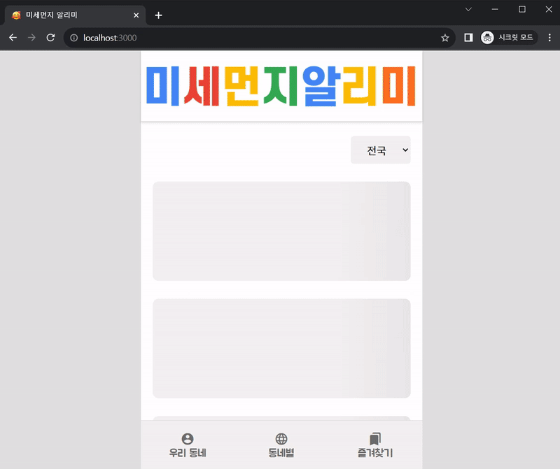
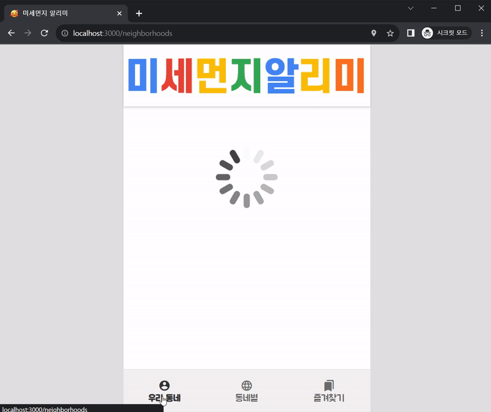
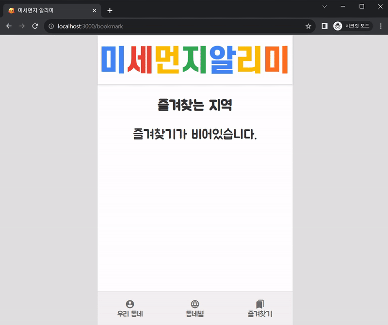
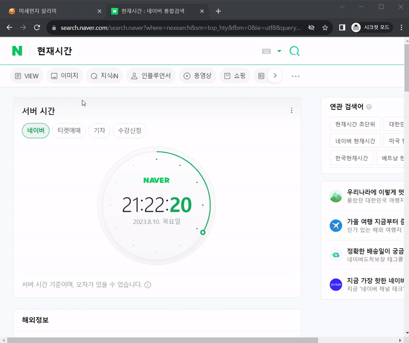

<div align="middle" >
  
  <p>“미세먼지 알리미”는 내 위치 및 시도별로 미세먼지 데이터를 실시간으로 모니터링하고,<br/> 관심 있는 지역을 즐겨찾기로 저장할 수 있는 웹 애플리케이션입니다.</p>
</div>

## 1. 시작하기

### 프로젝트를 로컬 환경에 복제합니다.

```bash
$ git clone https://github.com/deipanema/real-time-pm10.git
```

### 다음 명령을 실행하여 필요한 패키지를 설치합니다.

```bash
$ yarn install
```

### 프로젝트 루트 디렉토리에 `.env` 파일을 생성하고, 아래와 같이 환경 변수를 설정합니다.

```
REACT_APP_KAKAO_API_KEY=c8fbc4149b338ac6592a2d5757b5df6e
REACT_APP_AIRKOREA_API_KEY=1IJkAaFv8pgTv9qKNA2InjqJtlo5%2B9YfltWIuv8zmeZLjZ98UOGK8AX%2FvOHDQq9cWasRyLkEKN1pIi7U7R20TQ%3D%3D
```

### 다음 명령으로 개발 서버를 시작합니다.

```bash
$ yarn start
```

## 2. 기술 스택

- **Redux Toolkit:** 즐겨찾기 데이터 상태 관리
- **Redux Thunk:** 즐겨찾기 실시간 업데이트
- **REST API:** 미세먼지 관련 데이터 호출
- **React Router:** 페이지 라우팅
- **CRA(Create React App):** 프로젝트 초기 구조 및 설정

## 3. 주요 기능

### 3.1 동네별 미세먼지 정보 확인



- 사용자는 각 측정소별로 미세먼지 농도와 등급을 확인할 수 있습니다.
- 데이터를 더 가져오기 위한 더보기 버튼 클릭 시 “로딩중…” 문구로 데이터를 호출 로딩을 인지할 수 있습니다.

### 3.2 내 위치 근처 미세먼지 정보 확인



- 사용자 근처 측정소의 실시간 미세먼지 정보를 API로부터 가져옵니다. 미세먼지 등급에 따라 시각적인(이미지, 색상) 이미지로 상태를 표시합니다.
- 미세먼지 농도, 등급, 최종 업데이트 시간 등을 포함합니다.

### 3.3 즐겨찾는 지역



- 사용자는 즐겨찾는 지역을 추가하거나 삭제할 수 있습니다.
- 예외 상황에는 적절한 메시지를 표시합니다.
- 즐겨찾기는 로컬 스토리지에 저장되어 유지됩니다.

### 3.4 즐겨찾기 실시간 업데이트



- 즐겨찾기는 최신 정보로 즉시 업데이트됩니다.

## 4. 저작권 표시

### 4.1 사용한 Open API 출처:

1. 한국환경공단 에어코리아 API - 미세먼지 정보를 가져오기 위해 사용했습니다.
   - API 문서: [한국환경공단 에어코리아 API 문서](https://drive.google.com/drive/folders/141g2lcQmCuGBEjEBvfPUNe2xBfy4jDDx?usp=sharing)
   - 제공: 공공 데이터 포털 (https://www.data.go.kr/)
2. Kakao Developers API - 사용자의 위치 정보를 가져오기 위해 사용했습니다.
   - API 문서: [Kakao Developers API 문서](https://developers.kakao.com/docs/latest/ko/local/dev-guide#trans-coord)
   - 제공: Kakao Developers (https://developers.kakao.com/)

### 4.2 이미지 출처:

1. favicon.ico
   - 이미지 출처: [ICONS](https://icons8.com/icon/set/messaging/3d-fluency)
2. brand.png
   - 이미지 출처: 컬러풀한 템플릿 타이틀 [miri canvas](https://www.miricanvas.com/)
3. loading.gif
   - 이미지 출처: [loading.io](https://loading.io/)
4. good.gif, moderate.gif, bad.gif, very-bad.gif, error.gif
   - 이미지 출처: [Giphy](https://giphy.com/Emoji)
